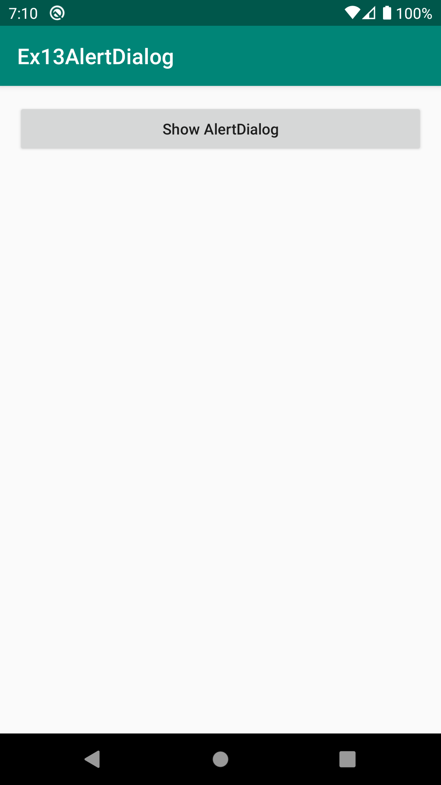
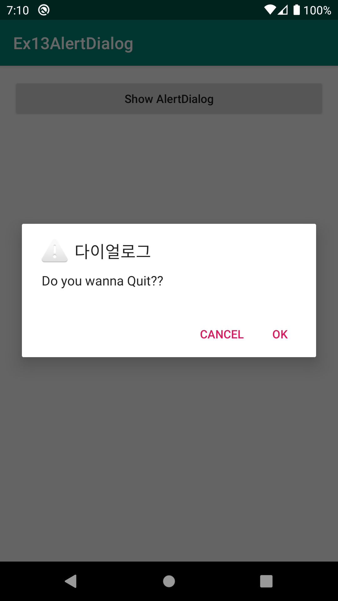
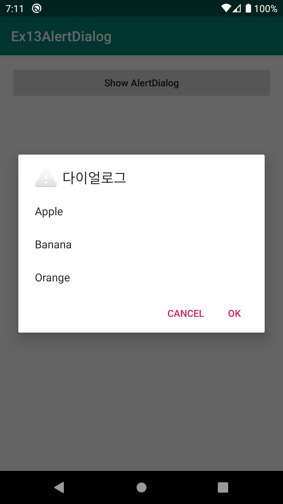
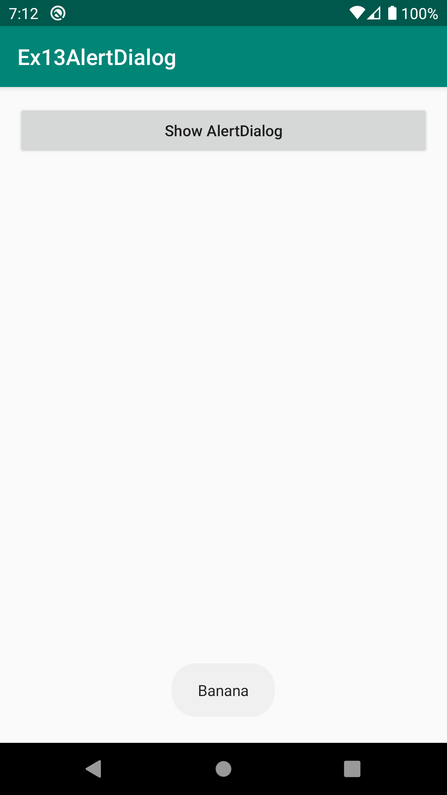
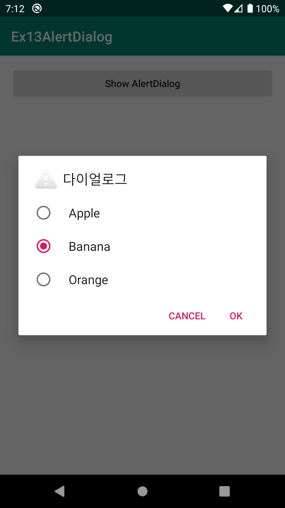
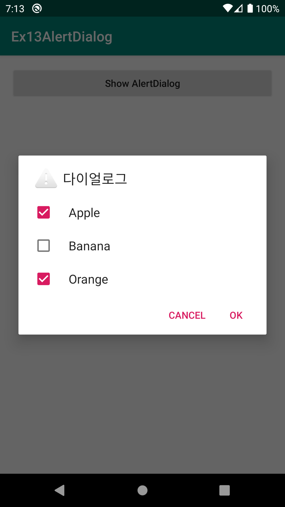
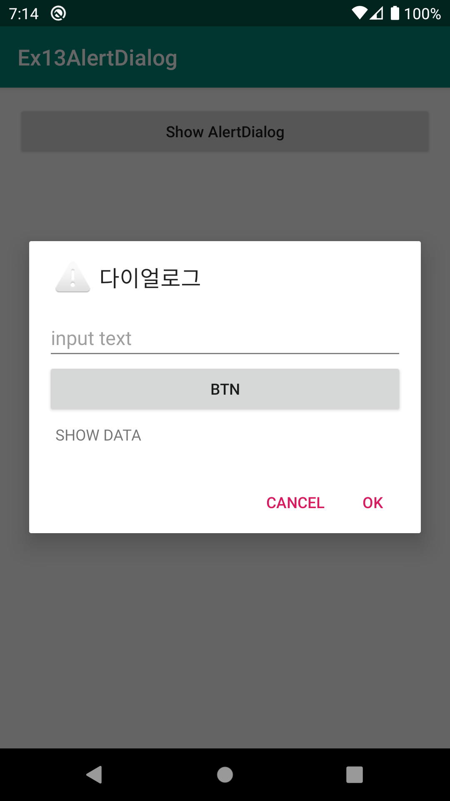
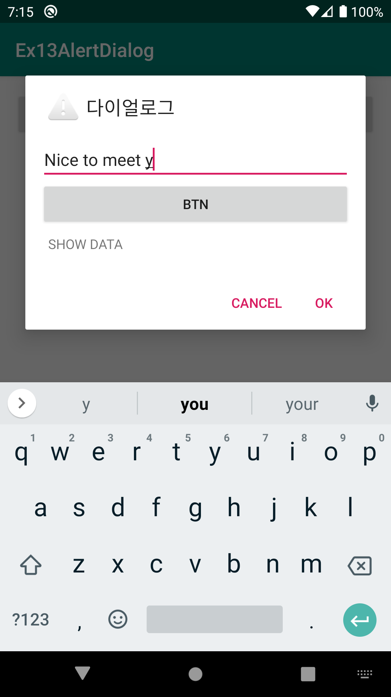
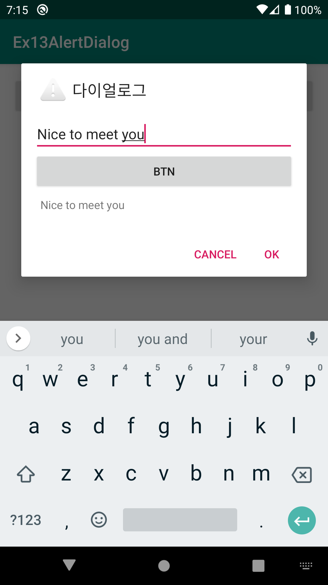

# Ex13AlertDialog
안드로이드 네이티브 앱 개발 수업 예제#13

# 주요코드
AlertDialog 객체 생성 및 보이기와 여러종류의 AlertDialog 알아보기

- 버튼을 클릭하여 기본적인 String메세지를 보여주는 Alert 객체 생성 및 보이기 [AlertDialog를 만들어주는 건축가(Builder)객체 생성]
- 여러모양의 AlertDialog 만들기 
  1) 단순 string 문자열 보여주기 
  2) AlertDialog의 메세지 영역에 단순 문자열이 아닌 항목(list)형태로 메세지영역 설정해 보기
  3) 라디오버튼이 있는 항목형태의 설정해 보기
  4) 체크박스버튼이 있는 리스트형태의 설정
  5) 커스텀뷰로 메세지영역 설정하기

# 실행모습

  <h4>[0. 첫화면] | [1. 단순 string] | [2. 리스트형식]</h4>  
  
  
  
  
  
  
  
  
  

# 실행모습 GIF

  

